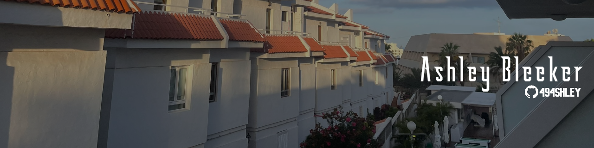



  

<h1 align="center">Hi, I'm Ashley 👋</h1>

  University of Sussex student building practical Python desktop tools and learning full-stack web development.

  
  

  

---

##  About Me

I'm a Computer Science student who learns best by building useful things from scratch.

Most of my current work is focused on **Clashly**, a Python desktop app for BlueStacks/ADB automation. Building it has helped me develop practical experience with desktop UI design, computer vision, automation, configuration systems, debugging, packaging, and user-focused release flows.

I like turning messy workflows into tools that feel clearer, safer, and easier to use.

---

## Tech Stack

### Languages

### Tools & Frameworks

---

##  Featured Project

### Clashly

**Clashly** is a Python desktop automation app built around BlueStacks and ADB workflows.

It includes:

- A Tkinter desktop interface
- Screenshot capture and image detection with OpenCV
- ADB and BlueStacks automation
- JSON profile and strategy configuration systems
- Stats tracking and progress views
- Debug logs and visual debugging tools
- Licensing and validation features
- Windows packaging with PyInstaller

---

##  Current Focus

- Improving my Python fundamentals through real projects
- Making Clashly more polished, reliable, and user-friendly
- Learning JavaScript, HTML, and CSS
- Building a personal portfolio website
- Getting better at Git, GitHub, and project documentation

---

##  What I'm Learning

I'm especially interested in desktop app development, automation, computer vision, packaging, and building software that is practical enough for real people to use.
